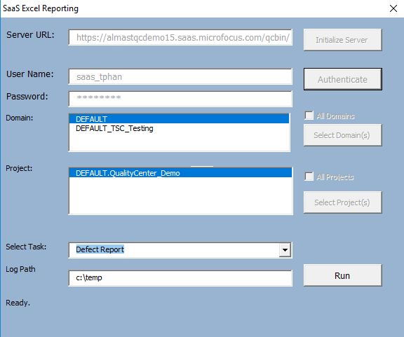
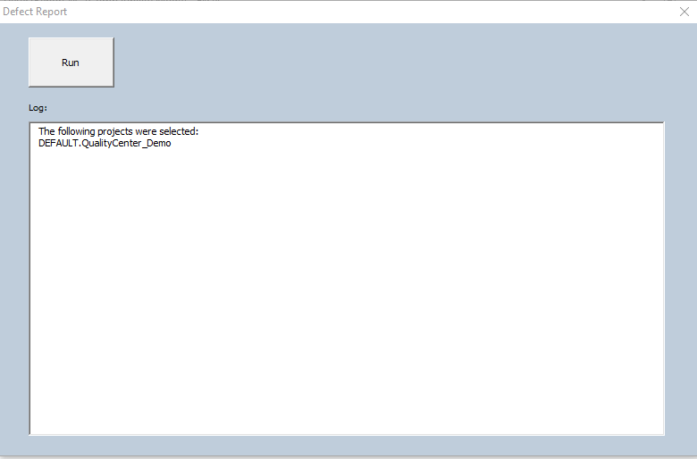

Add List Items to ALM Project lists

1.  Install the TDConnectivity from your ALM instance.

2.  Bring up the macro on a 32-bit Excel application.

3.  In the Connection tab, click on Execute button. Authentication
    dialog window appears.

{width="3.9348906386701663in"
height="3.3080818022747156in"}

4.  Enter the ALM URL and authentication credential. You will need a
    user with Customization permission in order to add list items to the
    project.

{width="4.500571959755031in"
height="3.7582895888013996in"}

5.  Click on Run button. Customization dialog button will appear.

{width="5.308665791776028in"
height="3.498274278215223in"}

6.  Click on the Run button in the Defect Report Dialog to generate the
    report. The report will generate a new tab for each project.
