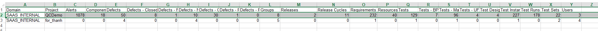

Module Count

1.  Install the TDConnectivity from your ALM instance.

2.  Bring up the Excel macro using 32-bit Excel.

3.  In the Connection tab, click on Execute button. Authentication
    dialog window appears.

{width="3.9348906386701663in"
height="3.3080818022747156in"}

4.  Enter the ALM URL and authentication credential. You will need a
    user with Customization permission in order to add list items to the
    project.

{width="4.500571959755031in"
height="3.7582895888013996in"}

5.  Click on Run button. A new dialog button will appear displaying
    projects selected.

{width="6.5in"
height="4.200694444444444in"}

6.  Click on the Run button. Report will be displayed in the "Module
    Count" tab.

{width="6.5in"
height="0.3506944444444444in"}
