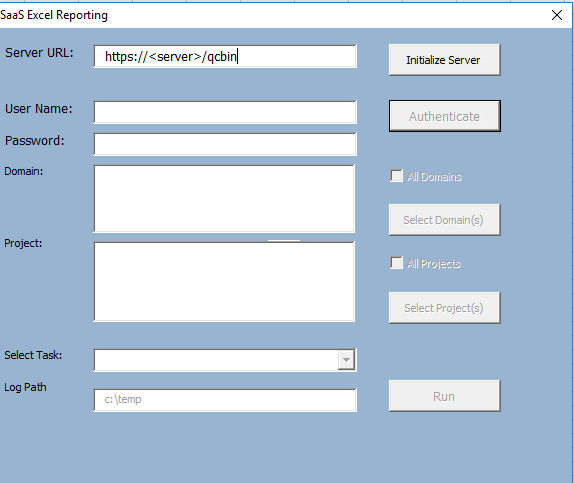
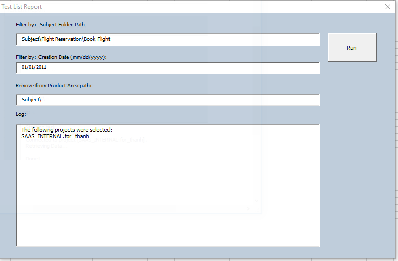
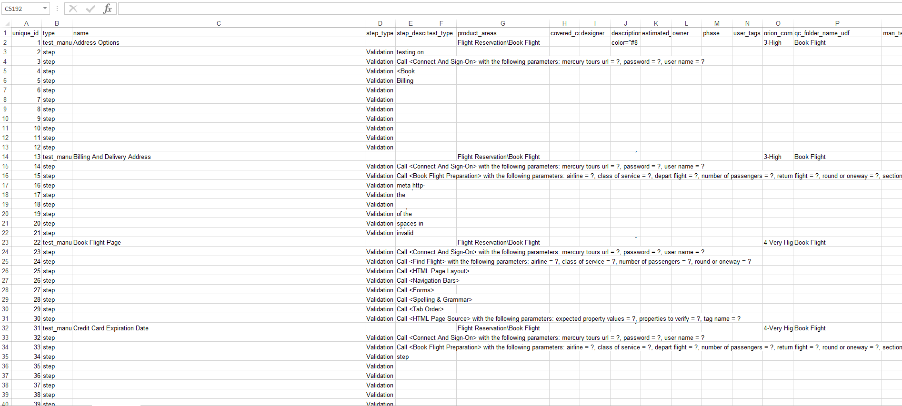
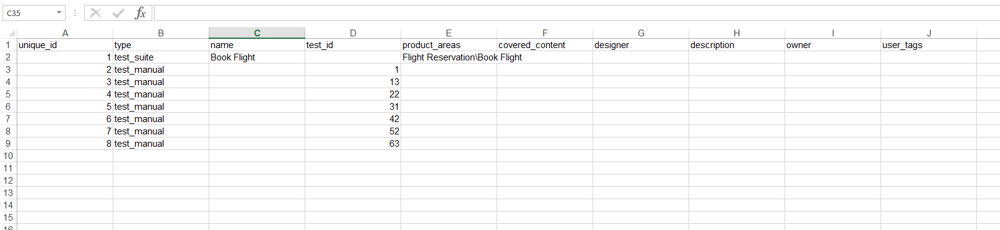

Export ALM QC Test Plan to Octane format

1.  This tool requires OTA to be registered

https://\<servername\>/qcbin/addins.html

2.  Launch the Excel Macro

Note: This macro only works on Excel 32-bit due to OTA limitation.

3.  In the Connection tab, click on Execute.

{width="2.740857392825897in"
height="2.306330927384077in"}

4.  Enter you login credential and select "Test List Report" from task
    lookup list.

5.  Click on Run. "Test List Report" dialog will appear.

There are 2 filters that need to be input:

a.  Subject Folder Path -- The location of the tests to be exported
    starting with "Subject\\"

b.  Creation Date -- Test creation date with mm/dd/yyyy format

> Specify the string to remove from Product Area path:
>
> Example:
>
> {width="3.5658245844269465in"
> height="2.339501312335958in"}

6.  Click on Run to being the data export. The manual tests will be
    exported to the "manual tests" tab. The folder\\test hierarchy will
    be exported to the "test suites". The subject path minus "Subject\\"
    will be added to the product_areas column.

Manual Tests:

{width="6.5in"
height="2.9270833333333335in"}

Test suites:

{width="6.5in"
height="1.5013888888888889in"}

Notes:

-   There is also another example called
    ExportBPTTestsToOctaneFormat.xlsm. This example is used for
    exporting BPT manual steps.

-   Password for viewing the source code is alm7292.
