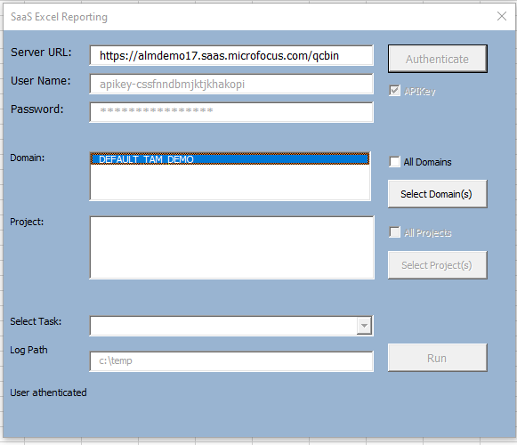
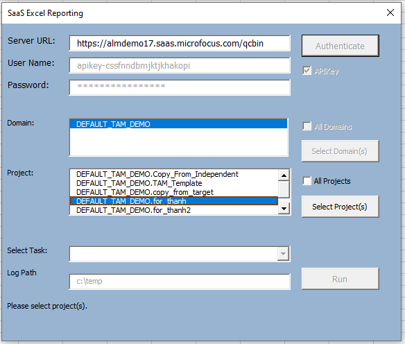
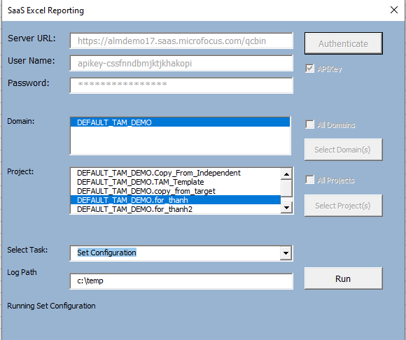
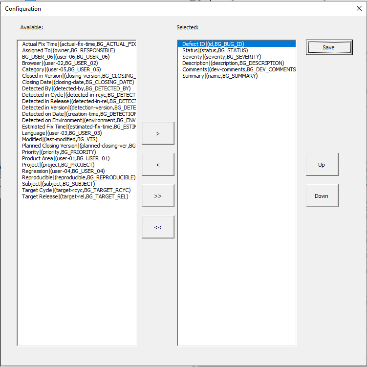
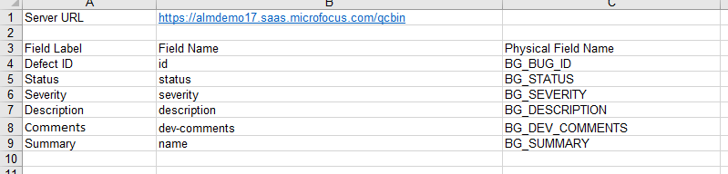
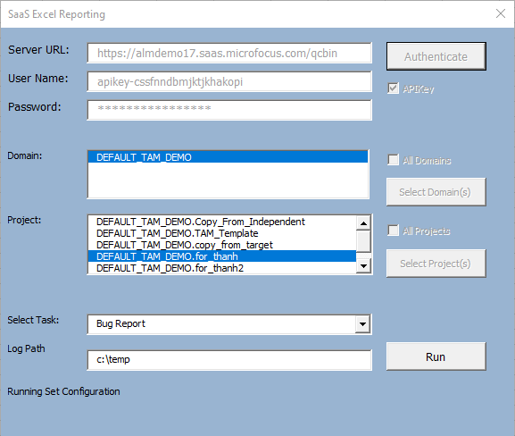
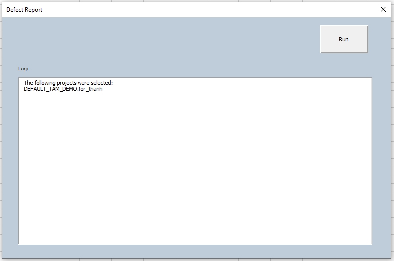
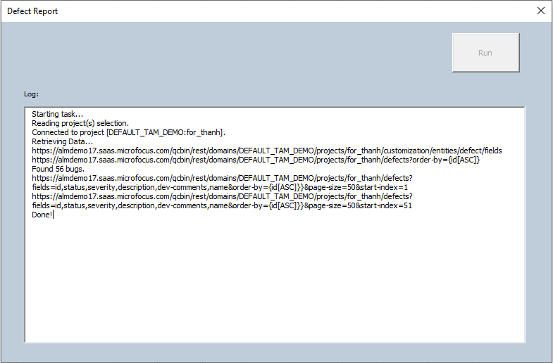
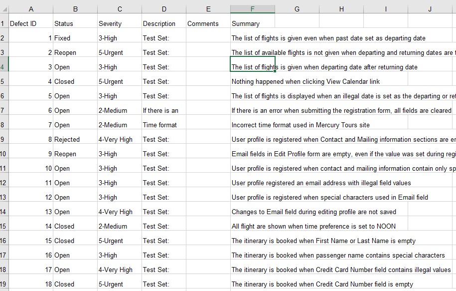

Export Defects Macro:

Requirements:

1.  This example uses REST. No OTA registration is thus required.

2.  Supports Excel 32-Bit and 64-Bit.

3.  Example allows both username/password as well as API Key. You will
    need an API Key for SSO authentication. If you don't have an API
    Key, then you can request your Administrator to create one.

{width="3.6881397637795277in"
height="3.1799048556430445in"}

Usage:

1.  Run the TestReport.xlsm. You should now see a Connection tab.

{width="5.9375in"
height="1.78125in"}

Note: You will need to enable macro if prompted.

2.  Click on "Execute" button.

{width="4.802083333333333in"
height="4.229166666666667in"}

3.  Enter your Server URL, username and password. Click on
    "Authenticate".

{width="6.041666666666667in"
height="5.166666666666667in"}

Notes: For SSO, you need to enable the "APIKey" checkbox and enter your
API Key and Secret.

4.  Select your domain(s) and click on "Select Domain(s)" button.

{width="6.052083333333333in"
height="5.208333333333333in"}

5.  Select your project(s) and click on "Select Projects" button.

{width="6.083333333333333in"
height="5.166666666666667in"}

Notes: Hold down shift key to multi-select items from list or click on
checkbox to select all.

6.  From the "Select Task" dropdown, select "Set Configuration". Click
    on "Run" button.

{width="6.041666666666667in"
height="5.0625in"}

7.  Make your fields selection. Use the buttons to move the fields from
    "Available" list to "Selected" list. You can move a field up and
    down by clicking on the corresponding buttons. Click on "Save".

{width="6.5in" height="6.5in"}

8.  The fields you selected will be saved to the "Configuration" tab.
    You do not need to run this again for subsequent reports if no
    changes are needed. You can manually edit the Configuration tab to
    do field selection.

{width="6.5in"
height="1.5618055555555554in"}

9.  Select "Bug Report" task. Click on "Run" button.

{width="6.010416666666667in"
height="5.083333333333333in"}

10. Report default to all folders under Subject. You can edit the
    Subject Path to filter.

Note: Accept default Subject\\ to generate report for all folders below
the Subject node.

11. Click on Run button to generate the report.

{width="6.5in"
height="4.303472222222222in"}

12. Log entries will be generated and saved to c:\\temp.

{width="6.5in"
height="4.272916666666666in"}

13. Upon completion, a new tab with the project name is created. The
    report with the fields selected will be displayed in this tab.

{width="6.5in"
height="4.141666666666667in"}
