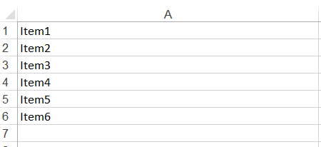
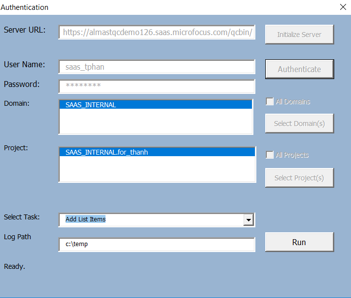
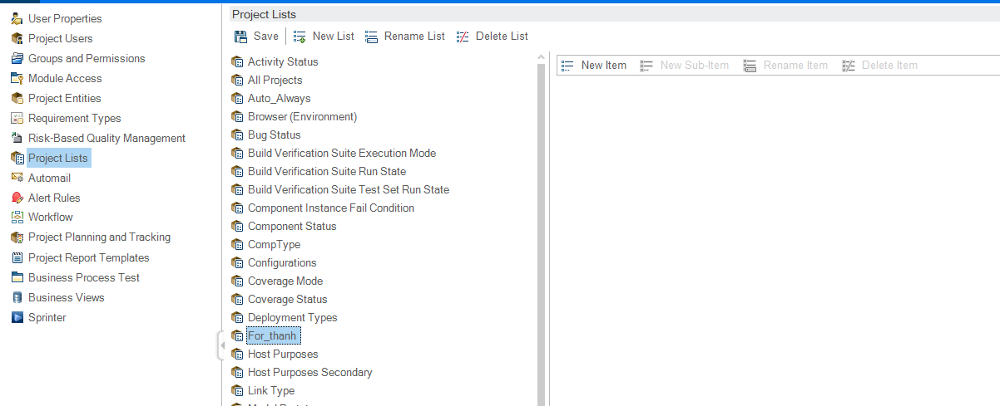
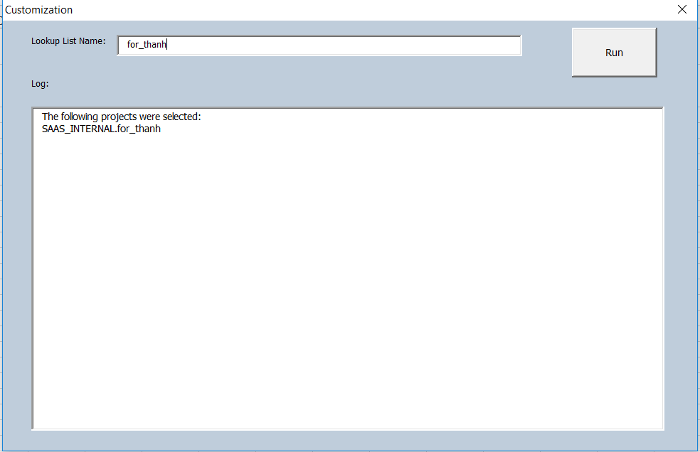
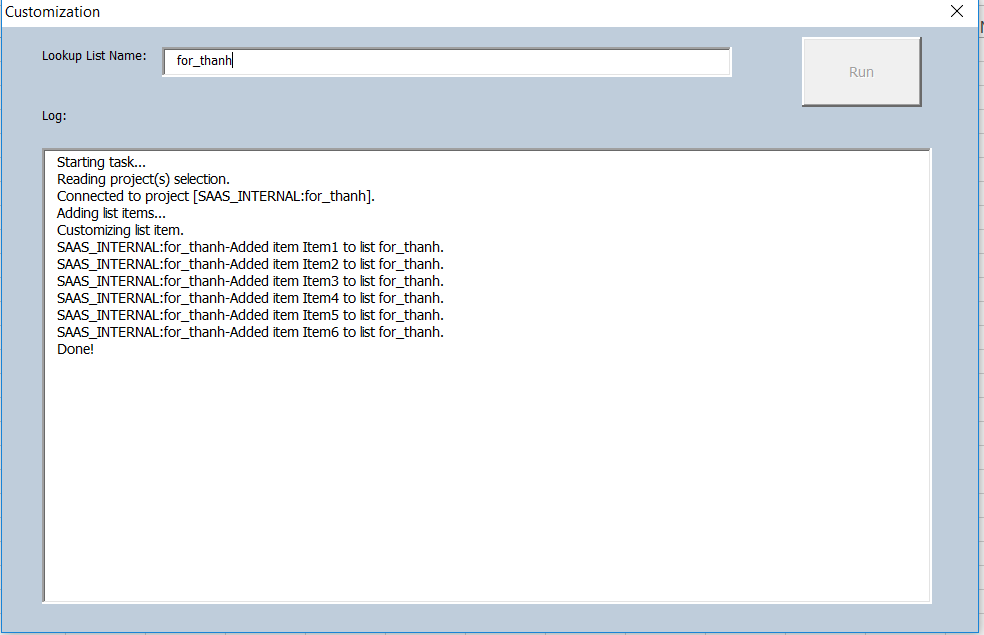
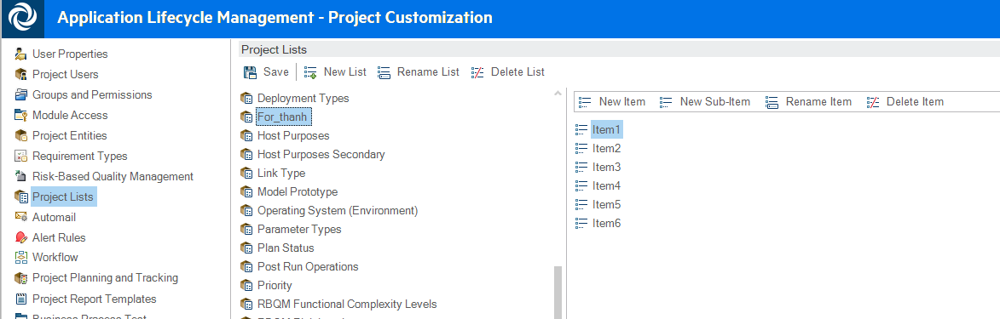

Add List Items to ALM Project lists

1.  Install the TDConnectivity from your ALM instance.

2.  Bring up the macro on a 32-bit Excel application.

3.  Navigate to the List tab and specify the items you want to add.

Example:

{width="4.6875in"
height="2.1458333333333335in"}

4.  In the Connection tab, click on Execute button. Authentication
    dialog window appears.

{width="3.9348906386701663in"
height="3.3080818022747156in"}

5.  Enter the ALM URL and authentication credential. You will need a
    user with Customization permission in order to add list items to the
    project.

{width="4.085884733158355in"
height="3.4603423009623797in"}

6.  Click on Run button. Customization dialog button will appear.

7.  In "Lookup List Name", specify the list you want to modify.

> Example:
>
> {width="6.5in"
> height="2.6444444444444444in"}
>
> {width="6.5in"
> height="4.201388888888889in"}

8.  Click on "Run" button to execute. Log will display actions taken.

{width="6.5in"
height="4.194444444444445in"}

9.  Review customization in ALM project.

{width="6.5in"
height="2.077777777777778in"}
