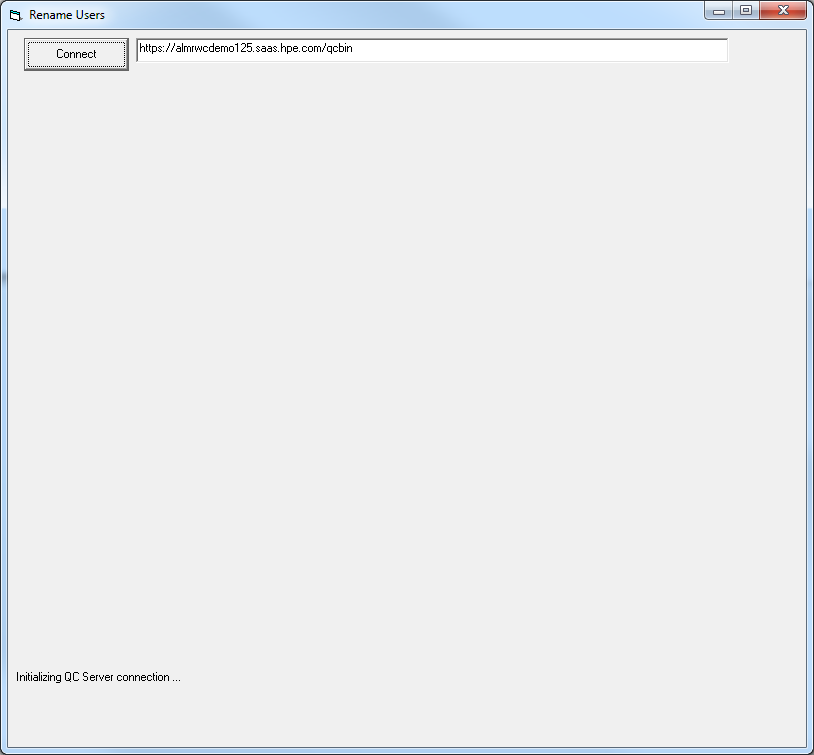
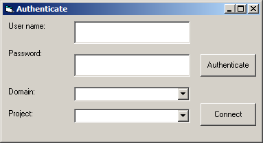
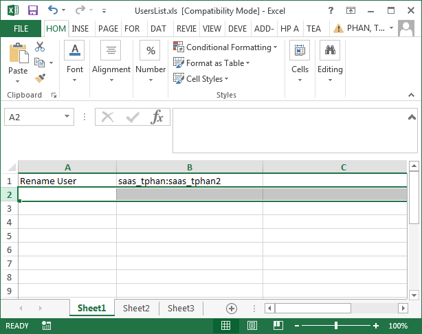

Usage:

1.  Download the zip file and extract the .exe.

2.  Double click on the RenameUser.exe.  You should now see as followed:

{width="4.240173884514435in"
height="3.9330325896762903in"}

3.  Enter your server information. Click on Connect.

4.  Enter your user credential and click on Authenticate.  You will need
    to use a TDAdmin account that has access to the project since the
    tool will need to run a number of SQL update statements. The project
    you select in this dialog will be used just for authentication.
    Click on Connect to authenticate.

{width="2.9890113735783026in"
height="1.6310793963254593in"}

5.  Select the domains and projects you want to update.

6.  Under the Customize pane, you want to enter the path of the
    UsersList.xls which contains the users you want to replace and the
    working directory where the log file will be written to.  The
    Userslist.xls should have the following format:

ColumnA = Task to perform which in this case is "Rename User"

ColumnB = olderuser:newuser

Here I am replacing saas_tphan with saas_tphan2

{width="6.395833333333333in"
height="5.0625in"}

Notes: You can addition more than 1 records to replace multiple uers.

7.  Enable the "Rename Users" checkbox.

8.  Click Update.

9.  The log files will be written to the c:\\temp\\RenameUsers folder.

Notes:

The utility works as followed:

-  The Old user must exist in the project.

-  The New user must NOT exist in the project.

-  Both users much already exist in the Site Admin.

\- The Old user will be removed from the project and the New user will
replace it in all places where the Old user was previously.

-  Log file generated (Ex. C:\\temp\\renameusers\\AutomatedChange.txt)
will identified what queries were ran and how many records were updated.

\- You will need to delete the old users from ALM Add-on or Site Admin
after the tool has been ran.

\- The tool will not update history entries
