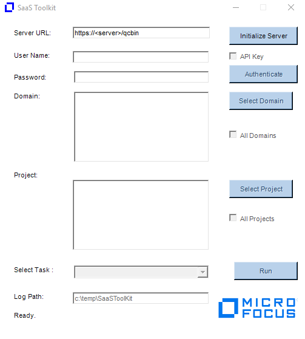
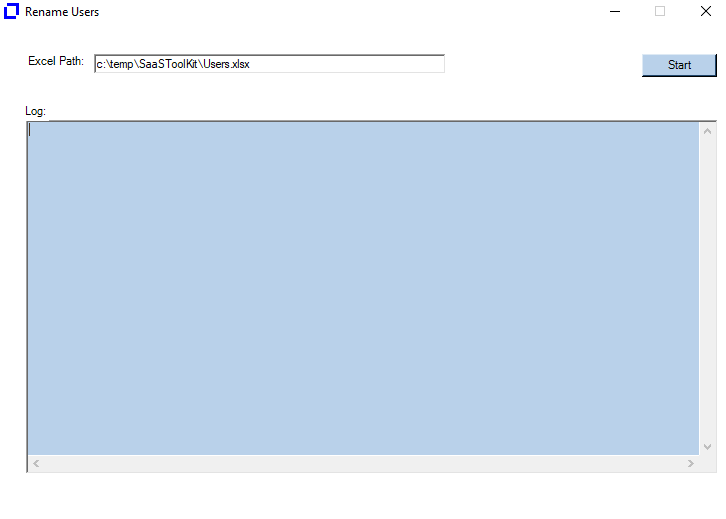
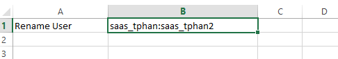
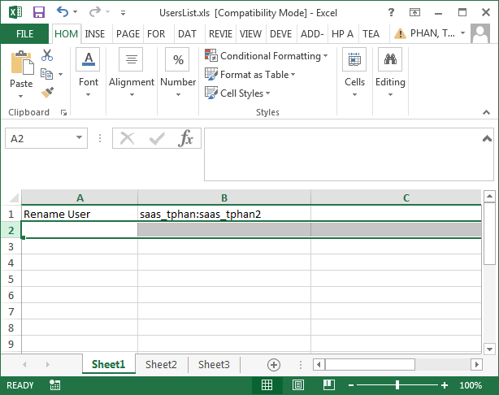

Usage:

1.  Download SaaSToolKit_RennameUser.exe

2.  Double click on the RenameUser.exe.  You should now see as followed:

{width="3.965971128608924in"
height="4.399625984251968in"}

3.  Enter your ALM URL and click on Initialize Server.

4.  Authenticate.  You will need a TDAdmin account that has access to
    the project since the tool will need to run a number of SQL update
    statements. The project you select in this dialog will be used just
    for authentication.

Notes: For SSO, you will need to create an API key and enable the API
Key check when authenticating.

5.  Select the domains and projects you want to update.

6.  Under Select Task, you need to select "Rename Users" and then click
    on Run button. The Rename Users Dialog will appear.

{width="4.8832939632545935in"
height="3.4908245844269468in"}

7.  Enter the path of the Users.xlsx file containing the users you want
    to replace. The default path it is expecting the file is under
    c:\\temp\\SaaSToolKit\\Users.xlsx

ColumnA = Task to perform which in this case is "Rename User"

ColumnB = olderuser:newuser

Here I am replacing saas_tphan with saas_tphan2

{width="5.0625in"
height="0.8854166666666666in"}

8.  Click on Start button to execute the task. The log file generated
    will be under c:\\temp\\SaaSToolKit.

{width="6.395833333333333in"
height="5.0625in"}

9.  Enable the "Rename Users" checkbox.

10. Click Update.

11. The log files will be written to the c:\\temp\\RenameUsers folder.

Notes:

The utility works as followed:

-  The Old user must exist in the project.

-  The New user must NOT exist in the project.

-  Both users much already exist in the Site Admin.

\- The Old user will be removed from the project and the New user will
replace it in all places where the Old user was previously.

-  Log file generated (Ex. C:\\temp\\renameusers\\AutomatedChange.txt)
will identified what queries were ran and how many records were updated.

\- You will need to delete the old users from ALM Add-on or Site Admin
after the tool has been ran.

\- The tool will not update history entries
