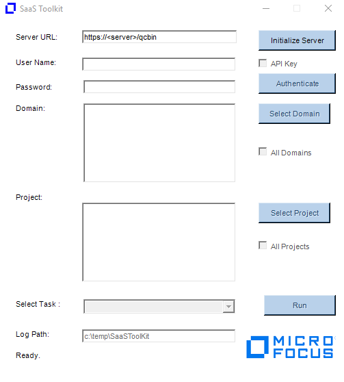

**Note: This tool is provided as is and Micro Focus is not responsible
for any potential issues. You should test it extensively first before
deciding to use it.**

I.  Authentication

<!-- -->

1.  Double click on the SaaSToolKit_UserManagement.exe.exe.  You should
    now see as followed:

{width="3.965971128608924in"
height="4.399625984251968in"}

2.  Enter your ALM URL and click on Initialize Server.

3.  Click on Authenticate button. 

4.  Select the domains and projects you want to run the tool against.

5.  Select the task you want to run.

6.  Click on Run button.

Notes:

-   The list of domains and projects you can see depends on the account
    used.

-   For SSO, you will need to create an API key and enable the API Key
    checkbox when authenticating.

II. **Add User to Project**

<!-- -->

1.  Bring up Excel and specify the users you want to add to projects.
    The format is as followed:

{width="2.521925853018373in"
height="1.8891852580927384in"}

Notes:

-   Keep the excel sheet title as "Sheet1"

2.  Select "Add Users to Projects" from the Select Task dropdown.

3.  Click on "Run"

4.  An "Add users to Projects" dialog will be displayed. Enter the path
    of the Excel file containing list of users to import.

{width="2.8868624234470692in"
height="2.2009241032370954in"}

5.  Click "Start"

6.  Output will be displayed in the dialog window and log file.

Notes and Limitations:

-   User account used for running the tool needs to have permission to
    add users to the selected projects. If you don't have enough
    permission, then the following error will be returned:

"You do not have the required permissions to get customization object."

III. **List Users and Group Permission**

<!-- -->

1.  Select "List Users to Projects" from the Select Task dropdown.

2.  Click on "Run"

3.  Click "Start"

4.  An Excel file, UsersList.xlsx, will be created under
    C:\\temp\\SaaSToolKit.

{width="4.1912117235345585in"
height="3.227590769903762in"}

IV. **Move users to Viewer group**

> This task is used for the purpose of removing users from all roles
> except for the Viewer role. The account needed to run the tool should
> be a TDAdmin to the projects you selected to run this tool. When being
> executed, the tool will first add the users to the Viewer group and
> then remove all the users from all roles. The user used to execute the
> tool will remain in the TDAdmin group. You can remove him from all
> projects by deleting him from the instance at a later time. Ideally,
> you should have at least one admin in the projects for administrative
> purpose.

1.  Create an excel file under c:\\temp\\saastoolkit and called it
    Readonly.xlsx. In the file, add the entry below:

{width="4.458338801399825in"
height="2.351106736657918in"}

Notes:

-   If you want to use different role other than Viewer, then you need
    to replace it here.

-   Keep the excel sheet title as "Sheet1"

2.  Select "Move Users to Viewer Group" under Select Task

3.  You should now see the dialog window below

{width="4.1977121609798775in"
height="3.1725010936132985in"}

4.  Click on Start button.

5.  The tool will execute the action.

{width="6.5in" height="4.9125in"}

V.  Rename User

This task allows you to rename existing users in a project to users
already existing in the Site Administrator. The tool will run TDCommand
query to update the various user fields in the projects. The tool
however will not update the audit_log (history) table.

1\. Create an Excel file called RenameUsers.xlsx as seen below:

{width="2.6041666666666665in"
height="0.9583333333333334in"}

2\. Select "Rename Users" under Select Task

> 3\. The Rename User dialog window opens.
>
> {width="6.5in"
> height="4.621527777777778in"}

4\. Click on Start button to execute the task.

> Notes:
>
> The utility works as followed:
>
> -  The Old user must exist in the project.
>
> -  The New user must NOT exist in the project.
>
> -  Both users much already exist in the Site Admin.
>
> \- The Old user will be removed from the project and the New user will
> replace it in all places where the Old user was previously.
>
> \- You will need to delete the old users from ALM Add-on or Site Admin
> after the tool has been ran.
>
> \- The tool will not update history entries
