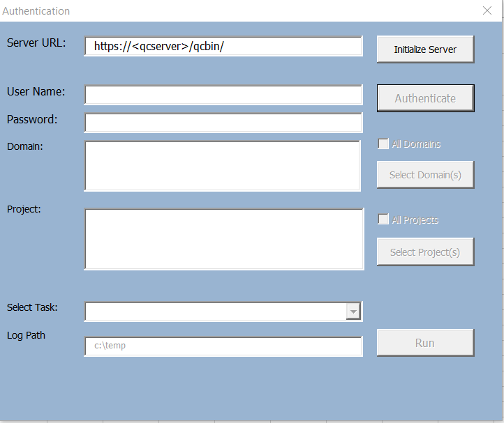

Add List Items to ALM Project lists

1.  Register the OTA Client from your ALM instance.

<https://almorg-demo.saas.microfocus.com/qcbin/CommonMode_index.html>

2.  Bring up the macro.

3.  Navigate to the Mapping List tab and specify the items you want to
    add.

Example:

{width="3.0625in"
height="3.4791666666666665in"}

4.  In the Connection tab, click on Execute button. Authentication
    dialog window appears.

{width="3.9348906386701663in"
height="3.3080818022747156in"}

5.  Enter the ALM URL and authentication credential. You will need a
    user with Customization permission in order to add list items to the
    project.

{width="3.501846019247594in"
height="2.979000437445319in"}

6.  Click on Run button. "Add Test Coverage" dialog button appears.

7.  Click on "Run" button to execute. Log will display actions taken.

{width="3.629583333333333in"
height="2.3937412510936134in"}

8\. Review the Test Coverage created.
