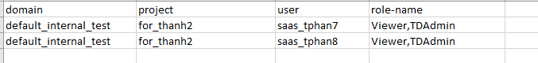
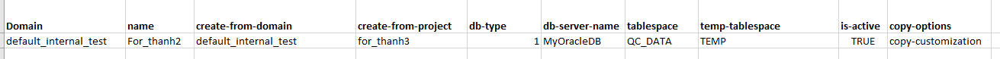
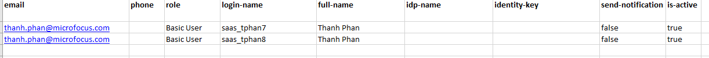

> Introduction:
>
> Starting in ALM 16, you can use the SA REST API to query data against
> the Web Administration Add-on. The existing REST API calls for ALM
> 15.5 Web Administration does not work for ALM 16. The examples
> provided here demonstrate how to use REST API to execute some of the
> most common administrative tasks in the Web Administration Add-on.
> Documentations on the Site Administration REST API is provided in the
> link below:
>
> https://admhelp.microfocus.com/alm/api_refs/site_admin_rest/Content/SA_REST_API/Welcome.html

Table of Contents:

I.  Server Connection

II. Activate or Deactivate Users

III. Add Users to Projects

IV. Create Projects

V.  Create Users

VI. Delete Users

VII. Delete Users from Projects

VIII. Unlock Users

IX. List Domains and Projects

X.  List Users in Projects

<!-- -->

I.  Server Connection -- Connect to your ALM instance to perform tasks
    using SaaS Administration REST API

<!-- -->

1.  Bring up the QC_SaaSAdminAddon.xlsm

2.  Navigate to the Connection tab

3.  Enter the ALM Server URL

4.  Enter your API Key and Secret. If you don't have this information
    then, you need to request from you Customer Admin to create one.

5.  Enter the Customer ID. You can get this information by logging into
    the Administration Addon -\> SaaS Information -\> Reports -\>
    Parameters -\> Customer ID report.

> {width="2.3854166666666665in"
> height="3.78125in"}

6.  Select the task you want to perform. Below are the possible Tasks

-   Activate/Deactivate Users

-   Add Users to Projects

-   Create Projects

-   Create Users

-   Delete Users

-   Delete Users from Projects

-   Unlock Users

-   List Domains and Projects

-   List Users in Projects

7.  Click on "Connect" button to execute

> {width="4.557822615923009in"
> height="2.5740004374453194in"}

II. Activate or Deactivate Users -- Use REST API to Activate or
    Deactivate users.

<!-- -->

1.  Navigate to the "Activate or Deactivate Users" tab

2.  Fill in the Excel row(s) with the user's information to
    active/deactivate

> login-name -- Name of the user to apply task
>
> is-activate -- Set value to "true" to activate user and "false" to
> deactivate
>
> Example:
>
> {width="2.9791666666666665in"
> height="0.9583333333333334in"}

III. Add Uses to Projects -- Use REST API to a add users to projects and
     groups. This example can also be used to remove a user from a group
     in a project. A user will need to belong to at least 1 group. You
     cannot remove a user from all groups in a project.

<!-- -->

1.  Navigate to the "Add Users to Projects" tab

2.  Fill in the Excel row(s) with the user's information to add to
    project

> domain -- Name of domain
>
> project - Name of project
>
> user -- Name of user to be added
>
> role-name -- Name of the group in the project
>
> Example:
>
> {width="6.5in"
> height="0.7680555555555556in"}

IV. Create Projects -- Use REST API to add project to instance

<!-- -->

1.  Navigate to the "Create Projects" tab

2.  Fill in the Excel row(s) with project's information to create

> Domain -- Name of the domain to place the project in
>
> name - Name of the project to be created
>
> create-from-domain -- Source project domain
>
> create-from-project -- Source project name
>
> db-type -- 1 for Oracle and 2 for MS SQL
>
> db-server-name -- Oracle host name
>
> tablespace - tablespace where data will reside (required for Oracle)
>
> temp-tablespace - temp tablespace (required for Oracle)
>
> is-active -- Project is active after creation
>
> copy-options -- Data to copy from source project (Please refer to
> online documentation for complete list of options)
>
> Example:
>
> {width="6.5in"
> height="0.38680555555555557in"}

V.  Create Users -- Use REST API to create new users in instance

<!-- -->

1.  Navigate to the "Create Users" tab

2.  Fill in the Excel row(s) with user's information to create

> email - Email of the user. Must be unique for SSO.
>
> phone - Phone of the user
>
> role -- SaaS Add-on Role. Possible value are "Basic User" and
> "Customer Admin". Other roles are possible if existing in instance.
>
> login-name -- Login Name of the user. Must be unique.
>
> full-name -- Full Name of the user.
>
> idp-name -- For SSO. Possible value is "alm" for SSO and "local" for
> non SSO users.
>
> identity-key -- For SSO. Must be unique value. Can be email or login
> name depending on setup. Field is case sensitive.
>
> send-notification - Set value to "true" to send email to user with
> login info and "false" to not send email
>
> is-active - Set value to "true" to make user active or "false" to
> deactivate user
>
> Example:
>
> {width="5.947345800524935in"
> height="0.49180008748906384in"}

VI. Delete Users -- Use REST API to delete users from instance

<!-- -->

1.  Navigate to the "Delete Users" tab

2.  Fill in the Excel row(s) with the project's information to delete

> login-name -- Name of the user to delete from instance
>
> Example:
>
> {width="1.6458333333333333in"
> height="1.1354166666666667in"}

VII. Delete Users from Projects -- Use REST API to delete users from
     projects

<!-- -->

1.  Navigate to the "Delete Users From Projects" tab

2.  Fill in the Excel row(s) with the user's information to delete

> domain - Name of domain
>
> project - Name of prjoect
>
> user - Name of the user to delete from project
>
> Example:
>
> {width="4.052083333333333in"
> height="0.9583333333333334in"}

VIII. Unlock Users -- Use REST API to unlock users from Site Admin

<!-- -->

1.  Navigate to the "Unlock Users" tab

2.  Fill in the Excel row(s) with the user login name

> Example:
>
> {width="2.2291666666666665in"
> height="1.3541666666666667in"}

IX. List Projects and Domain -- Use REST API to get list of domains and
    projects in the instance. Only the list of projects under the End
    Customer will be displayed.

<!-- -->

1.  Navigate to the "List Domains and Projects" tab

> Example:
>
> {width="6.5in"
> height="0.8423611111111111in"}

X.  List Users in Projects -- Use REST API to get list of projects and
    the users in the project.

> Example:
>
> {width="6.5in"
> height="1.4930555555555556in"}
